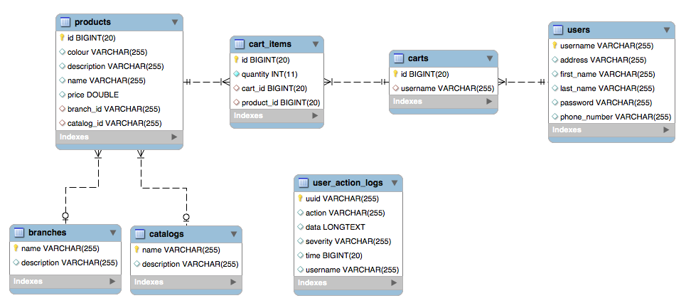

# Overview
This project is for demonstrate a sample online shop back-end using `Spring Boot`, `Hibernate`. 
This project contains:
* A **Product** service to let user search for the products they like by `name`, `category`, `branch` ...
* A **Log Service** to log for user's actions, it also could receive the logs from other services
* A **Cart Service** to support check out whenever user decided to buy items in their carts

# Prerequisite
In order to run and build this product you should use
* Java version from `1.8` to above
* Gradle installed (prefer version `4.10.2` to above)

# Build, run and test
Start the server by run

```
./gradlew build bootRun
```

After the server is started, you could try out the APIs.

# API sample commands
## Search product
```
curl --location --request POST 'http://localhost:8080/product/search' --header 'Content-Type: application/json' --data-raw '{ "term" : "", "column" : "name", "operator":"like", "page" : 0 }'
curl --location --request POST 'http://localhost:8080/product/search' --header 'Content-Type: application/json' --data-raw '{ "term" : "100", "column" : "price", "operator":"greater", "page" : 0 }'
```
**Response**:

```
{"status":200,"message":null,"results":[{"id":10,"name":"Asus SSD 2","description":"Asus SSD 2","price":100.1,"colour":"Red","catalog":{"name":"SSD","description":"description SSD"},"branch":{"name":"Asus","description":"Asus"}},{"id":11,"name":"Asus GPU 1","description":"Asus GPU 1","price":110.11,"colour":"Green","catalog":{"name":"GPU","description":"description GPU"},"branch":{"name":"Asus","description":"Asus"}},{"id":12,"name":"Asus GPU 2","description":"Asus GPU 2","price":120.12,"colour":"Blue","catalog":{"name":"GPU","description":"description GPU"},"branch":{"name":"Asus","description":"Asus"}},{"id":13,"name":"CM PSU 1","description":"CM PSU 1","price":130.13,"colour":"Red","catalog":{"name":"PSU","description":"description PSU"},"branch":{"name":"Cooler Master","description":"Cooler Master"}},{"id":14,"name":"CM PSU 2","description":"CM PSU 2","price":140.14,"colour":"Green","catalog":{"name":"PSU","description":"description PSU"},"branch":{"name":"Cooler Master","description":"Cooler Master"}},{"id":15,"name":"Asus Main 1","description":"Asus Main 1","price":150.15,"colour":"Blue","catalog":{"name":"MAIN","description":"description Main Boards"},"branch":{"name":"Asus","description":"Asus"}},{"id":16,"name":"Asus Main 2","description":"Asus Main 2","price":160.16,"colour":"Red","catalog":{"name":"MAIN","description":"description Main Boards"},"branch":{"name":"Asus","description":"Asus"}}]}
```

## Log message
```
curl --location --request POST 'http://localhost:8080/logs' --header 'Content-Type: application/json' --data-raw '{ "action" : "logging", "severity" : "warn", "data":"{\"user\":\"username\",\"items\":[{\"product\":\"1\",\"quantity\":1},{\"product\":\"2\",\"quantity\":2}]}" }'
```
**Response**:

```
{"status":201,"message":null,"results":"created"}
```

## Checkout cart
```
curl --location --request POST 'http://localhost:8080/cart/checkout' --header 'Content-Type: application/json' --data-raw '{ "user": "user", "items": [ { "product": 1, "quantity": 1 }, { "product": 2, "quantity": 2 } ] }'
```
**Response**:

```
{"status":201,"message":null,"results":{"id":3}}
```

# Design
## ERD Diagram
